# Cyber Deception in EV Charging Systems

A two-part research project on securing Electric Vehicle Supply Equipment (EVSE):

1. **Honeypot** — a custom deception layer that simulates a real EV charging station over the OCPP protocol to lure and log attackers in real time
2. **ML Detection** — machine-learning models trained on multi-modal EVSE sensor data (network traffic, host events, power consumption) to classify attacks

---

## Honeypot — EVSE Cyber-Deception Interface

A custom-built honeypot that impersonates a live EVSE over the **OCPP (Open Charge Point Protocol)**, broadcasting realistic charging telemetry to attract adversaries while monitoring all interactions.

**Capabilities:**
- Simulates charging state, power draw, and voltage in real time
- Detects and classifies suspicious activity with structured severity levels

| Severity | Event Type | Example |
|---|---|---|
| INFO | Normal EVSE activity | Charging 20.5% \| 3.84kW @ 234.0V |
| LOW | Suspicious connection | WebSocket connection attempt |
| HIGH | Active reconnaissance | TCP Stealth/SYN Scan |
| CRITICAL | Exploit attempt | Malformed OCPP Packet / Injection Attempt |

**Live system screenshots:**

| | |
|---|---|
| 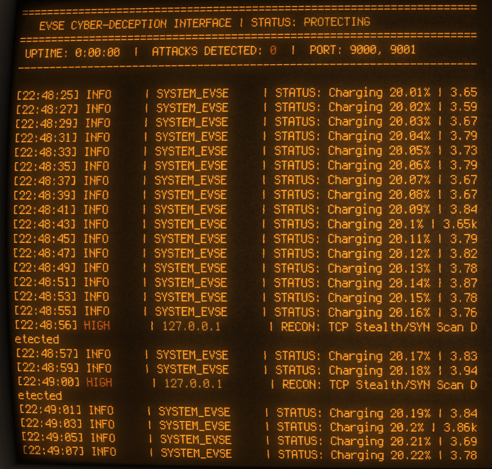 | 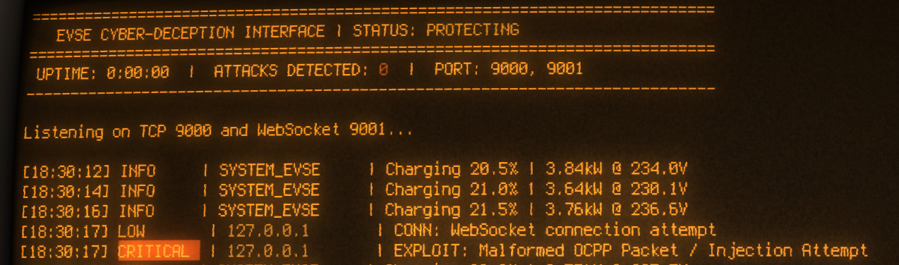 |
| HIGH: TCP Stealth/SYN Scan detected | CRITICAL: Malformed OCPP Packet / Injection Attempt |

---

## ML Detection

### Dataset

The EVSE dataset covers two physical EVSE devices (EVSE-A, EVSE-B) under 17+ attack scenarios across three sensor modalities:

| Modality | Features | Size |
|---|---|---|
| Network Traffic | NFStream flow features | ~2.7M flows, 86 columns |
| Host Events | HPC + Kernel counters | ~8.5K samples × 915 features |
| Power Consumption | INA219 sensor readings | ~115K samples |

**Attack types:** SYN-Flood, TCP-Flood, UDP-Flood, ICMP-Flood, Push-ACK Flood, Port Scan, Aggressive Scan, Vulnerability Scan, SYN-Stealth, OS Fingerprinting, Service Detection, Synonymous IP, Cryptojacking, Backdoor

> Dataset: CICEVSE2024 (not included in this repo)

### Notebooks

| Notebook | Description |
|---|---|
| `EVSE.ipynb` | Data exploration and preprocessing across all three modalities |
| `EVSE1.ipynb` | Cross-device generalization — train on EVSE-A, evaluate on EVSE-B |
| `EVSE2.ipynb` | Power consumption anomaly detection (Isolation Forest, Random Forest) |
| `EVSE3.ipynb` | Network traffic classification with correlation-based feature selection |

All notebooks run on **Google Colab** with data mounted from Google Drive.

### Models

Isolation Forest · Random Forest · XGBoost · Logistic Regression · MLP · LSTM

### Results

**Model training:**

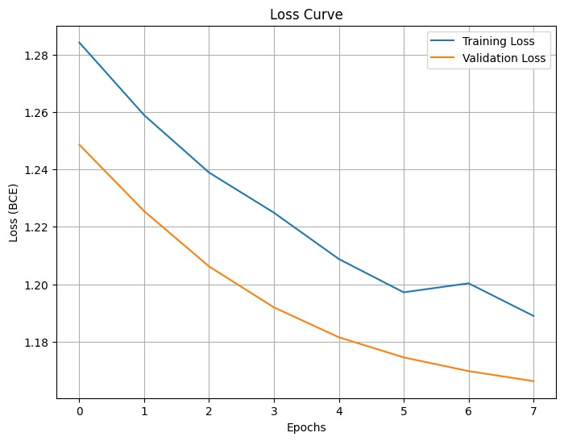
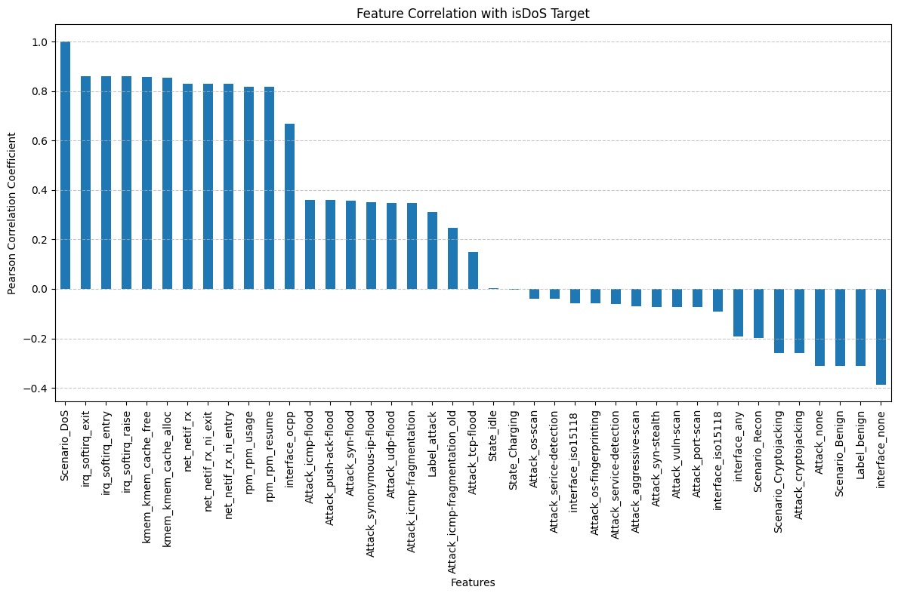

**Dataset distributions (EDA):**

| | |
|---|---|
| 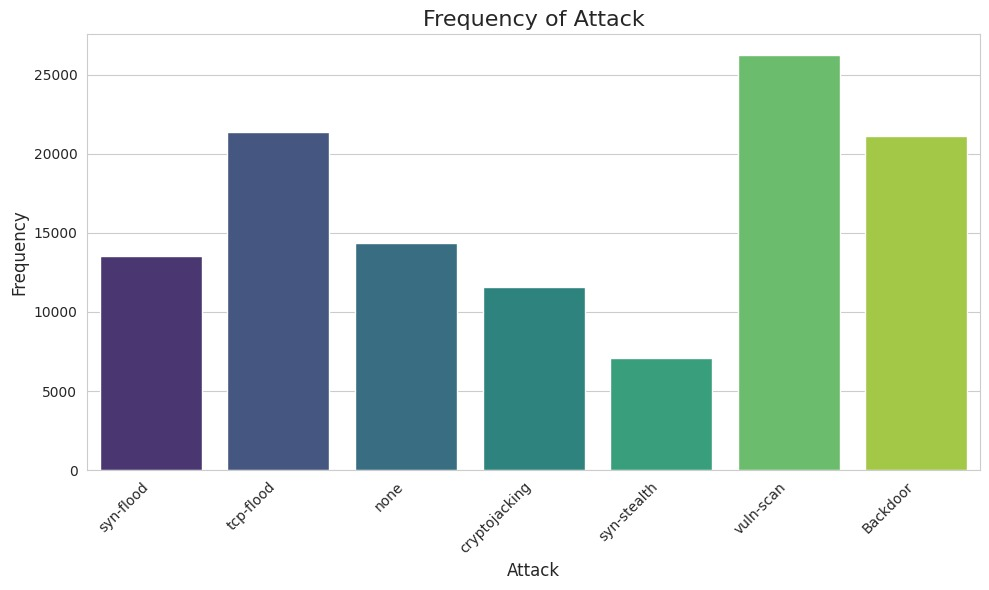 | 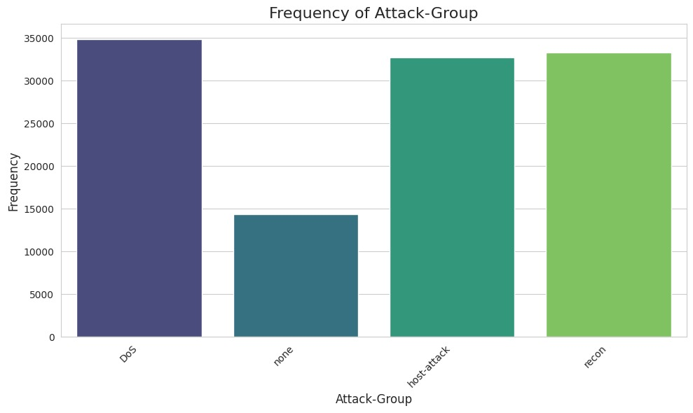 |
| 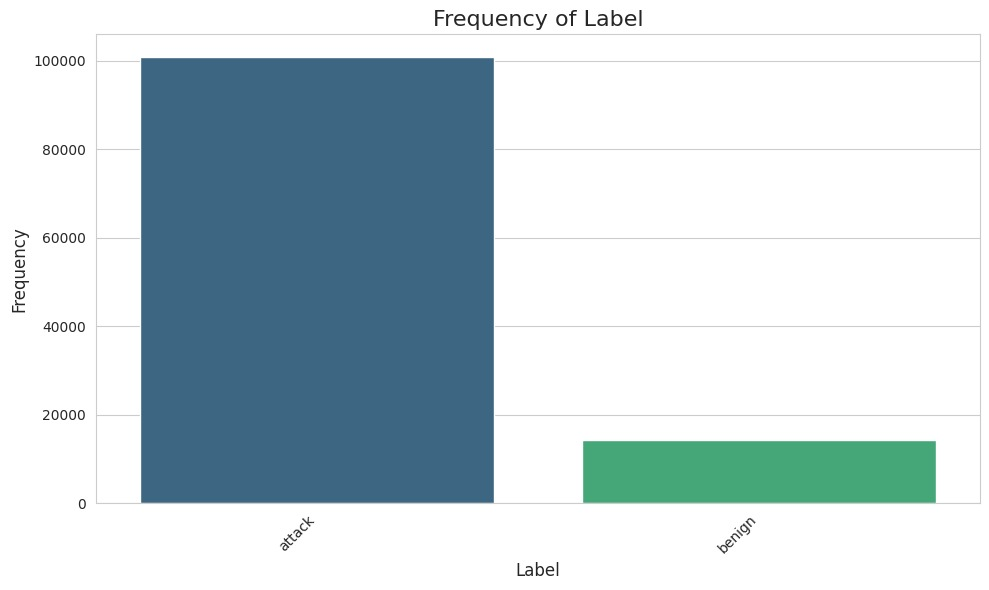 | 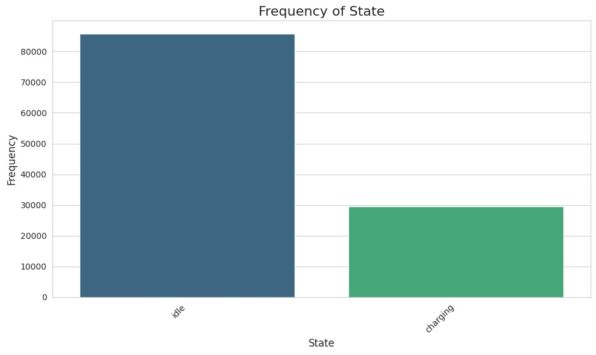 |

**Power consumption sensor distributions:**

| | |
|---|---|
| 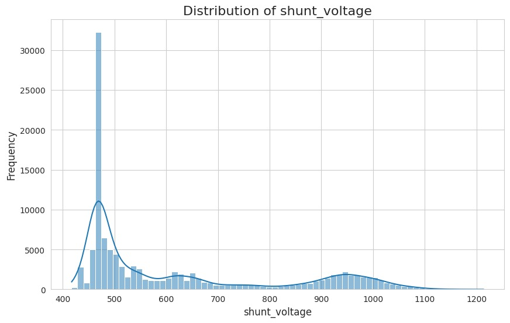 | 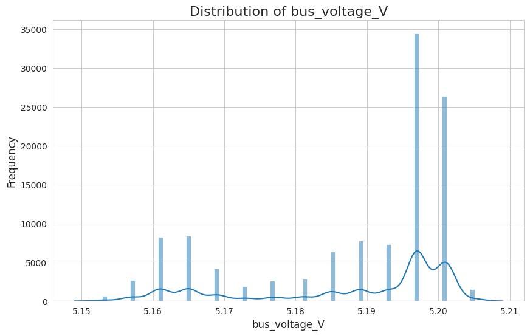 |
| 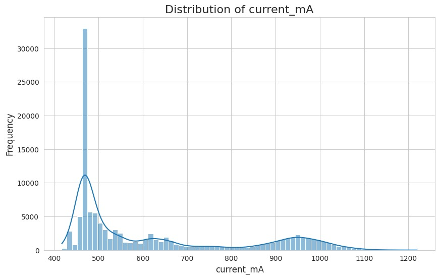 | 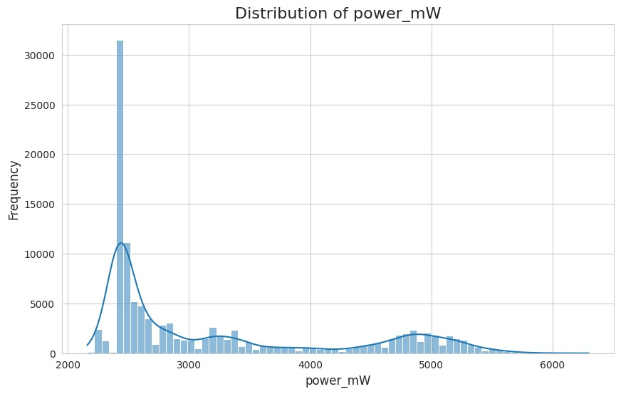 |

---

## Requirements

```
pandas · numpy · scikit-learn · xgboost · matplotlib · seaborn
```

---

## Citation

If you use this work or the dataset, please cite:

**Dataset:**
> Euclides Carlos Pinto Neto et al., "CICEVSE2024: A Cybersecurity Dataset for Electric Vehicle Supply Equipment," Canadian Institute for Cybersecurity, University of New Brunswick, 2024.

---

## License

Code and notebooks in this repository are released under the [MIT License](LICENSE).
The CICEVSE2024 dataset is subject to its own terms of use — refer to the dataset source for details.
